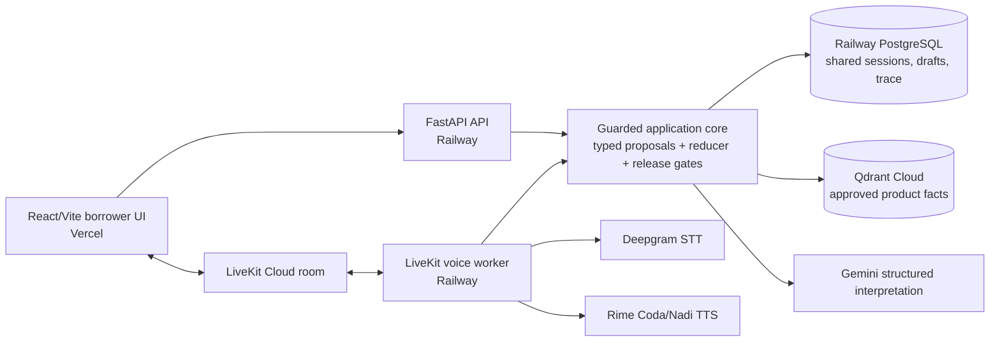

# Saarthi: Voice-first loan guidance

Saarthi is a doubt-aware, state-consistent voice experience for a **fictional personal-loan pre-application**. It proves that a borrower can answer one field at a time, ask a contextual question, correct an earlier answer, interrupt speech, and resume without corrupting the draft.

## Problem

Personal-loan applications often present unfamiliar terms, amounts, fees, and conditions as a long sequence of fields. When a borrower has a doubt or wants to correct an earlier answer, a rigid form or IVR can make them lose context or abandon the process. Saarthi addresses this focused problem with a phone-first conversation that lets the borrower interrupt, clarify, correct, and safely resume the same draft. Voice is essential because the defining interaction happens while the question is being spoken—not in a separate help screen.

The prototype is deliberately draft-only. It does not submit an application, approve or reject a loan, perform KYC, create a mandate, collect payment, or make a lending recommendation.

## Demo and submission artifacts

- Live demo: [saarthi-voice-loan-assistant.vercel.app](https://saarthi-voice-loan-assistant.vercel.app/)
- Recorded demo: [Saarthi final demonstration](https://drive.google.com/file/d/18vE89MKZmlIuyni7mWPibXO2snnknSdI/view?usp=sharing)
- User story: [phone_first_loan_application_user_story.md](docs/phone_first_loan_application_user_story.md)
- Workflow figure: [figure1_doubt_aware_voice_agent_workflow_300dpi.pdf](docs/figure1_doubt_aware_voice_agent_workflow_300dpi.pdf)
- Technical requirements: [phone_first_loan_application_technical_requirements_revised.md](docs/phone_first_loan_application_technical_requirements_revised.md)
- MVP design: [phone_first_loan_mvp_design_refined_draft.pdf](docs/phone_first_loan_mvp_design_refined_draft.pdf)
- Pitch deck: supplied alongside the repository in the submission package
- Product fact sheet: [PRODUCT_FACT_SHEET.md](docs/PRODUCT_FACT_SHEET.md) · [canonical JSON](data/product/saarthi_product_facts_v1.json)

## What the MVP proves

The selected hard voice problem is interruption and recovery with state consistency. A finalized user turn is converted into a typed proposal; deterministic guards decide whether it can change the draft. When the borrower interrupts, the system increments a generation boundary, stops obsolete playback, fences delayed model/tool results, answers the doubt from approved facts or deterministic calculations, and resumes the correct pending field.

The six technical requirements are:

1. off-path turn understanding;
2. state-consistent interruption, correction, and resumption;
3. grounded contextual explanation;
4. faithful controlled financial speech;
5. persistent user control and cancellation; and
6. neutral, draft-only completion.

## Architecture



The API and voice worker are separate Railway services. They must reference the same PostgreSQL service through `DATABASE_URL`; otherwise the worker can receive a LiveKit room but cannot resolve the session created by the API.

## Repository layout

```text
src/saarthi/
  api/          FastAPI sessions, tokens, controls, reads and export
  agent/        LiveKit worker, STT events, turn handling and audio publication
  domain/       Typed contracts, field rules, reducer and state machine
  providers/    Gemini, Groq, Deepgram, Rime, Qdrant and cache adapters
  services/     Interpretation, grounding, calculation, planning and rendering
  storage/      SQLAlchemy repository: PostgreSQL production, SQLite local
  scripts/      Fact-sheet compilation, ingestion and provider preflight
web/            React/Vite borrower and evidence-dashboard UI
data/product/   Versioned synthetic product facts
tests/          Unit, scenario, integration, provider-contract and red-team tests
docs/           Implementation and test-plan notes
```

## Local setup

Requirements: Python 3.12+, [`uv`](https://docs.astral.sh/uv/), Node.js 18+, and npm.

```powershell
git clone https://github.com/Pramit726/saarthi-voice-loan-assistant.git
cd saarthi-voice-loan-assistant
Copy-Item .env.example .env
uv sync --dev
uv run saarthi-rime-preflight
uv run saarthi-ingest
```

Run the three local processes in separate terminals:

```powershell
# API
uv run saarthi-api

# LiveKit voice worker
uv run saarthi-agent dev

# Borrower UI and dashboard
cd web
npm install
npm run dev
```

The local default database is SQLite. For production, set `DATABASE_URL` to the shared Railway PostgreSQL reference in both the API and worker services.

## Configuration hygiene

`.env.example` contains placeholders only. Copy it to `.env` locally and never commit `.env` or provider secrets. The frontend receives only the public API base URL and a short-lived LiveKit participant token; provider keys and database credentials remain server-side.

Required server-side provider settings are:

```ini
LIVEKIT_URL=
LIVEKIT_API_KEY=
LIVEKIT_API_SECRET=
LIVEKIT_AGENT_NAME=saarthi

DEEPGRAM_API_KEY=
GEMINI_API_KEY=
GROQ_API_KEY=
RIME_API_KEY=

QDRANT_URL=
QDRANT_API_KEY=
QDRANT_COLLECTION=loan_product_facts
DATABASE_URL=sqlite+aiosqlite:///./data/saarthi.db
```

For the deployed services, use `ENVIRONMENT=production`, the same PostgreSQL `DATABASE_URL` in both Railway services, and an explicit `CORS_ORIGINS` containing the Vercel origin. The Vercel build uses:

```ini
VITE_API_BASE_URL=https://your-railway-api-domain.up.railway.app
```

## Exact Rime configuration

Saarthi uses the LiveKit Rime plugin with the following fixed demonstration profile:

| Setting | Value |
|---|---|
| Model ID | `coda` |
| Speaker | `nadi` for English and Hindi profiles |
| Language values | `eng` and `hin` internally, selected from `en-IN` and `hi-IN` sessions |
| Endpoint | `wss://users-ws.rime.ai` |
| Transport | Rime WebSocket streaming through the LiveKit Rime plugin |
| Audio format | `audio/pcm`, mono, 24,000 Hz |
| Delivery tuning | `speedAlpha=0.92`, sentence-segmented output |

The endpoint is selected by the Rime plugin when `use_websocket=True`; it is not exposed to the browser. The listener-oriented renderer creates short labelled segments and reuses the same structured financial projection for written and spoken output.

Run the secret/configuration preflight after setting `RIME_API_KEY`:

```powershell
uv run saarthi-rime-preflight
```

The command checks that the secret is present without printing it, verifies `coda`, `nadi`, `eng`/`hin`, 24 kHz, WebSocket mode, and the expected endpoint. It exits non-zero if the local configuration is incomplete.

## Third-party services

| Service | Role | Production placement |
|---|---|---|
| Vercel | React/Vite frontend | Borrower UI and evidence dashboard |
| Railway | FastAPI API and LiveKit worker | Two services from this repository |
| Railway PostgreSQL | Authoritative application, checkpoint, idempotency and trace store | Shared by API and worker |
| LiveKit Cloud | Realtime room transport and agent dispatch | Browser-to-worker voice path |
| Deepgram | Streaming speech recognition | Worker-side STT |
| Gemini | Structured interpretation for unresolved turns | Server-side proposal generation |
| Rime | Controlled speech synthesis | Worker-side Coda/Nadi WebSocket TTS |
| Qdrant Cloud | Version-filtered approved product-fact retrieval | `loan_product_facts` collection |
| Groq | Optional grounded wording adapter | Disabled in the default low-latency path |

## Product knowledge

The source artifact is the reviewed synthetic fact sheet in `data/product/`. Compile or update it before ingestion, then ingest the approved facts into Qdrant:

```powershell
uv run saarthi-compile-facts
uv run saarthi-ingest
```

The runtime filters by product, version, fact-set version, and `approved` status. If Qdrant or the cache is unavailable, the application falls back to the bundled approved local facts. Retrieval never writes application state.

## Failure behavior

- A model response is an untrusted proposal; it cannot directly mutate the application.
- Ambiguous, hedged, or unsupported field answers are held for clarification or confirmation.
- A product claim without approved evidence is withheld and replaced with a safe fallback.
- Arithmetic uses the deterministic calculator and is invalidated when a dependent input changes.
- Stop, pause, go-back, correction, and newer turns increment the generation before replacement work starts.
- Delayed results and queued audio from an older generation are discarded and cannot re-enter the conversation.
- A transient provider failure may receive one bounded retry; validation, grounding, and revision failures do not retry automatically.
- Rime or playback failure stops incomplete audio and offers repeat or written output without changing the draft.
- The browser Submit button only marks the synthetic demo complete and stops the voice worker; there is no lender request.

## Evaluation and evidence

The repository contains deterministic tests for TR-1 through TR-6, scenario fixtures, replay checks, and opt-in provider tests. Run the safe local suite with:

```powershell
uv run pytest -m "not live and not manual"
```

Opt-in provider checks consume external quota:

```powershell
$env:RUN_LIVE_TESTS="1"
uv run pytest -m live
```

The short Rime-specific claim, acceptance test, procedure, result, repeatable command, and limitations are recorded in [`RIME_EVIDENCE.md`](RIME_EVIDENCE.md).

The built-in evidence dashboard reports current-session traces, selectable session history, and cross-session KPIs. Historical benchmark numbers in the MVP design were produced from synthetic development sessions; the production deployment smoke check verifies connectivity and configuration but is not a new quality or latency benchmark.

## Known limitations

- Synthetic, bounded product and borrower data only.
- One fictional product and no real lender integration.
- No authentication, KYC, credit decision, approval, rejection, mandate, payment, submission, or disbursal.
- Acceptance evidence is strongest for the bounded English flow; Hindi output is configurable but broader multilingual/code-switched recognition is future work.
- Production telephony, long-term memory, human handoff, accessibility compliance, and independent user studies are out of scope.
- Latency depends on the selected browser, network, and external providers; reported values are engineering measurements, not service-level guarantees.
